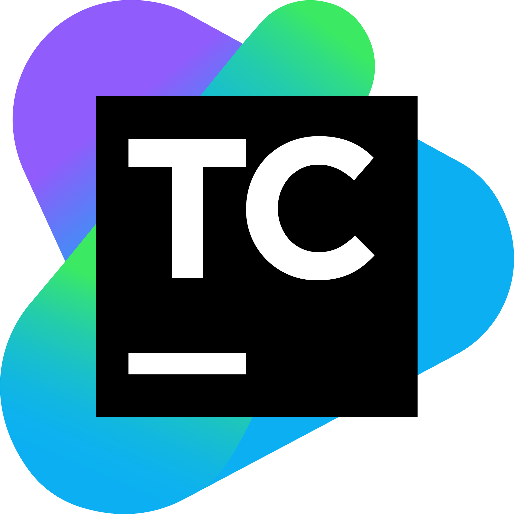

### Hi there, I'm [Affan!](https://affanhaq.me/) 👋

 

### Current Projects

##### Envy Client - [envyclient.com](https://envyclient.com)
##### Pixels - [haq/pixels](https://github.com/haq/pixels)
##### Web Shop - [haq/web-shop](https://github.com/haq/web-shop)

### Languages and Tools

 
 

<!--
**haq/haq** is a ✨ _special_ ✨ repository because its `README.md` (this file) appears on your GitHub profile.

Here are some ideas to get you started:

- 🔭 I’m currently working on ...
- 🌱 I’m currently learning ...
- 👯 I’m looking to collaborate on ...
- 🤔 I’m looking for help with ...
- 💬 Ask me about ...
- 😄 Pronouns: ...
- ⚡ Fun fact: ...
-->
